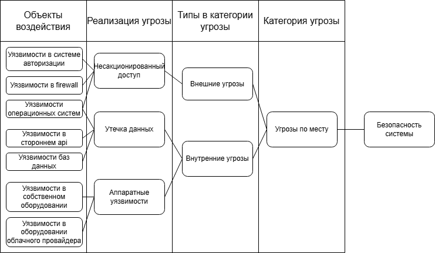

## Классификаци данных

### Публичные данные

1) Данные по объектам недвижимости
2) Данные для проведения онлайн тура

### Внетренние данные

1) Данные по услугам ЖКХ собственников
2) Данные по сделкам с недвижимостью

### Конфиденциальные данные

1) Данные по собственникам
2) Данные покупателей
3) Данные клиентов
4) Данные о транзакциях

### Секретные данные

1) Стратегия компании
2) Финансовые отчеты

## Риски
### Публичные данные

| Тип угрозы            | Описание                                                                                                                                                                                          | Уровень        |
|-----------------------|---------------------------------------------------------------------------------------------------------------------------------------------------------------------------------------------------|----------------|
| утечка данных         | данные публичны, так что риска утечки нет                                                                                                                                                         | ОТСУТСТВУЕТ    |
| потеря данных         | риск потери данные присутствует, потеря данных приведет к необходимости заново заполнять данные по объектам и подготавливать данные для проведения онлайн туров, что может быть весьма затратно   | ЗНАЧИТЕЛЬНЫЙ   |
| искажение данных      | искажение данные приведет к введению в заблуждение клиентов                                                                                                                                       | НЕЗНАЧИТЕЛЬНЫЙ |
| некачественные данные | некачественные данные по проведению онлайн туров могут привести к бесполезности данной услуги                                                                                                     | НЕЗНАЧИТЕЛЬНЫЙ |
| обесценивание данных  | данные для проведения онлайн туров устаревают по мере продажи недвижимости. Снижение привлекательности онлайн туров, упущенная выгода из-за отсутствия информации для клиентов по новым объектам  | НЕЗНАЧИТЕЛЬНЫЙ |

### Внутренние данные

| Тип угрозы            | Описание                                                                                     | Уровень        |
|-----------------------|----------------------------------------------------------------------------------------------|----------------|
| утечка данных         | конкуренты могут извлечь выгоду из анализа данных по сделкам и услугам                       | ЗНАЧИТЕЛЬНЫЙ   |
| потеря данных         | потеря данных приведет к проблемам при обслуживании собственников и задержкам при оплате ЖКУ | ЗНАЧИТЕЛЬНЫЙ   |
| искажение данных      | искажение данных приведет к неверным начислениям по ЖКУ                                      | НЕЗНАЧИТЕЛЬНЫЙ |
| некачественные данные | некачественные данные приведут к проблемам при обслуживании собственников                    | НЕЗНАЧИТЕЛЬНЫЙ |
| обесценивание данных  | устаревшие данные могут привести к выставлению неправильных счетов на оплату ЖКУ             | НЕЗНАЧИТЕЛЬНЫЙ |

### Конфиденциальные данные

| Тип угрозы            | Описание                                                                                                                                                                                             | Уровень        |
|-----------------------|------------------------------------------------------------------------------------------------------------------------------------------------------------------------------------------------------|----------------|
| утечка данных         | утечка ПД приведет к штрафам, искам и репутационному ущербу, а так же к уходу клиентов, судебным издержкам и приостановке деятельности                                                               | КРИТИЧЕСКИЙ    |
| потеря данных         | потеря данных приведет к необходимости восстановления данных, потере клиентов и проблемам с обслуживанием собственников и невозможности проводить сделки. Потеря истории взаимоотношений с клиентами | КРИТИЧЕСКИЙ    |
| искажение данных      | искажение данных приведет к ошибкам в реквизитах для выплат, неверным начислениям по ЖКУ                                                                                                             | ЗНАЧИТЕЛЬНЫЙ   |
| некачественные данные | дублирование записей о клиентах, неверные телефоны устаревшие пд снизят эффективность маркетинга и приведут к недовольству клиентов из-за ошибок и повторного запроса информации                     | НЕЗНАЧИТЕЛЬНЫЙ |
| обесценивание данных  | риски аналогичны некачественным данным. Кроме того, стоит учесть затраты на хранение данных и защиту данных, которые не приносят бизнес-ценности                                                     | НЕЗНАЧИТЕЛЬНЫЙ |

### Секретные данные

| Тип угрозы            | Описание                                                                                                                                                                                            | Уровень      |
|-----------------------|-----------------------------------------------------------------------------------------------------------------------------------------------------------------------------------------------------|--------------|
| утечка данных         | приведет потере конкурентного преимущества, репутационный и финансовый ущерб, потеря клиентов и партнеров                                                                                           | КРИТИЧЕСКИЙ  |
| потеря данных         | невозможность анализ и планирования из-за потери исторических аналитических данных. Потеря управляемости компанией, срывы договоров и невозможность составления отчетов                             | КРИТИЧЕСКИЙ  |
| искажение данных      | принятие неверных решений, финансовое мошенничество, введение в заблуждение акционеров и инвесторов, потеря их доверия                                                                              | КРИТИЧЕСКИЙ  |
| некачественные данные | ошибки при принятии важных управленческих решений                                                                                                                                                   | ЗНАЧИТЕЛЬНЫЙ |
| обесценивание данных  | потеря конкурентоспособности из-за устаревших подходов и неспособности увидеть новые тренды развития. Неадекватная оценка рисков при внедрении новых проектах, принятая на основе устаревших данных | ЗНАЧИТЕЛЬНЫЙ |

## Mindmap

