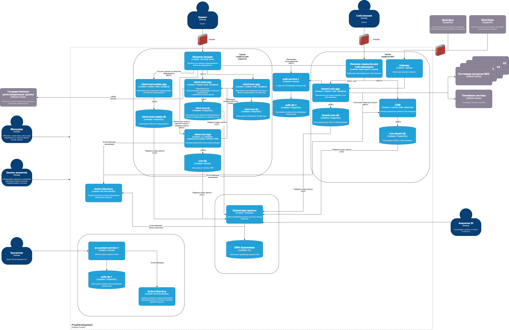

## Требования к интеграции с системами умного дома

### Требования
Процесс авторизации должен происходить внутри системы PropDevelopment. Данные пользователей не должны передаваться в
сервисы умного дома. 
Домофон и Шлагбаум должные производить авторизацию через tenant-core-app
Взаимодействие будет происходить через шлюз по REST API с использованием TSL 1.2+ шифрования. Все попытки авторизации и 
внешних вызовов API должны логироваться и фиксироваться в системе аудита.
В некоторых API фигурируют персональные данные, поэтому стоит пересмотреть политику работы с данными. 
Ввести классификацию данных и не передавать ПД во внешние сервисы.